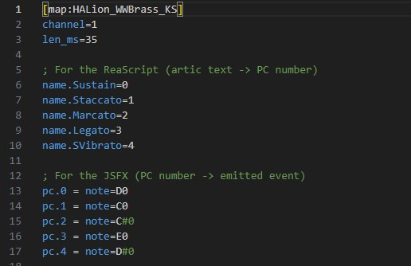
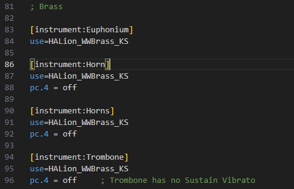
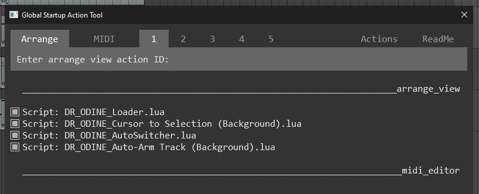
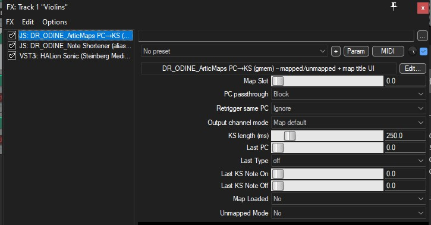

## Dr. Odine's Incredible Notation Enhancement System v1.0

### Overview

This package is a comprehensive orchestral template system for REAPER that automates articulation switching and dynamics processing without having to leave the Notation Editor. It helps bridge the gap between musical notation software workflow and DAW-based orchestral composition by providing intelligent mapping between notation events (articulation, dynamics, etc.) and MIDI commands. This system is an alternative to Rearticulate for composers who prefer working in the Notation Editor rather than being constantly stuck in the MIDI piano roll. The inspiration for this project came from spending time learning and enjoying using Dorico, and then wishing I could have some of that same functionality and workflow in Reaper's notation editor.

This is normal text.

<small>This should be smaller text.</small>
This is subscript (small and low)
This is superscript (small and high)

This is normal text again.

 

Store and configure your articulation maps in the provided **ArticMaps.ini** file:

 

Run the following background scripts on startup using Amely_Suncroll's [Global Startup Action Tool](https://forum.cockos.com/showthread.php?t=294133):

Add the DR_ODINE_ArticMaps PC --> KS (gmem)' and the DR_ODINE_Note Shortener jsfx plugins to each track fx chain before your VSTi. You can set this to the default chain to avoid having to do this everytime:

## Installation Requirements

- REAPER 6.0 or later
- ReaPack package manager for automated installation
- SWS (I have modified a script by cfillion which uses a corresponding .jsfx in the SWS cfillion collection, so this is required for a slightly streamlined note replace function)
- Please also install and utilize the [Global Startup Action Tool](https://forum.cockos.com/showthread.php?t=294133) by Amely_Suncroll to automatically run all the DR_ODINE background scripts at application launch

After installing DR_ODINE Notation Enhancement v1.0 via ReaPack please watch my video where I demo the system and explain how to get everything setup. You will also need to spend a bit of time inputting your mapping preferences in the ArticMaps.ini file located in the REAPER/Data/DR_ODINE Maps/ folder. However, once you have configured everything properly, you will have a streamlined workflow that doesn't need to be re-configured again unless you add new mapping to new VSTi instruments later.

## Core Components

### JSFX Effects

#### Key Switch (gmem).jsfx
**Purpose**: Main articulation processor that converts Program Change messages to keyswitch notes, CCs, or other MIDI events.

**Features**:
- **Dual Mode Operation**: Mapped mode and unmapped mode (intelligent fallback).
- **Shared Memory Integration**: Uses gmem to store mapping configurations across multiple instances
- **Real-time Map Display**: Shows current map name and slot information in the UI
- **Automatic Mode Switching**: Seamlessly switches between mapped/unmapped based on AutoSwitcher input
- **Pre-roll Support**: Shifts Program Changes earlier in time to ensure keyswitches trigger before notes
- **Cross-item Processing**: Can extend pre-roll into adjacent previous items for seamless playback
- **Channel Routing**: Maps incoming PC messages to different output channels as needed

**Configuration Parameters**:
- Map slot selection (0-31)
- Program Change (PC) message passthrough toggle
- Retrigger control for same PC values
- Output channel mode selection
- Keyswitch length timing

#### Unmapped Note Shortener.jsfx
**Purpose**: Shortens note lengths based on CC119 articulation markers for any VSTi without any user created mapping.

**Features**:
- **CC119 Stamp Processing**: Reads articulation tags (staccato/marcato) from CC119 messages
- **Intelligent Note Shortening**: Applies different lengths based on articulation type
- **Aliasing Prevention**: Handles note-on/note-off timing to prevent stuck notes
- **Cross-block Stability**: Manages scheduled note-offs across audio processing blocks
- **Safe Toggling**: Can be disabled without stranding active notes

### Core Processing Scripts

#### ArticPC.lua
**Purpose**: Main articulation and dynamics processor that converts text events to Program Changes and CC1 dynamics.

**Features**:
- **Dual Processing Modes**: Mapped mode with INI configuration, unmapped fallback for unconfigured instruments
- **Text Event Parsing**: Converts notation software articulation text to MIDI events
- **Dynamic Dynamics Processing**: Handles crescendo, diminuendo, and accent markings with proper cross-item ramping
- **Intelligent Pre-roll**: Shifts Program Changes earlier to ensure keyswitch timing
- **Cross-track Processing**: Searches across multiple items for crescendo targets
- **Accent Enhancement**: Automatically boosts dynamics for accent markings
- **Toast UI Feedback**: Provides visual feedback without cluttering REAPER console

**Supported Text Events**:
- Articulations: sustain, staccato, legato, marcato, pizzicato, spiccato, tremolo
- Dynamics: ppp, pp, p, mp, mf, f, ff, fff
- Special markings: crescendo, diminuendo, accent
- Phrase markings: automatic legato detection from slur indicators

#### Dynamics to Velocity Scripts (All Notes / Selected Notes)
**Purpose**: Alternative processing that applies dynamics directly to MIDI note velocities instead of CC1 while in mapped mode.

**Features**:
- **Direct Velocity Mapping**: Converts dynamic markings to note velocities
- **Crescendo Ramping**: Calculates smooth velocity transitions across note ranges
- **Accent Processing**: Boosts velocity for accented notes
- **Selective Processing**: "Selected Notes" variant only affects currently selected MIDI notes
- **Cross-item Intelligence**: Handles crescendos that span multiple MIDI items

### System Automation Scripts

#### Loader.lua
**Purpose**: Initializes the ArticMaps system by loading configuration data into shared memory.

**Features**:
- **INI File Processing**: Parses ArticMaps.ini configuration file
- **Shared Memory Population**: Loads maps into gmem slots for JSFX access
- **Registry Generation**: Creates lookup tables for instrument-to-slot mapping
- **Fuzzy Matching Setup**: Builds normalized lookup indices for flexible instrument name matching
- **Roman/Arabic Numeral Handling**: Converts between different numbering systems in instrument names

**Process Flow**:
1. Parse ArticMaps.ini file structure
2. Assign map slots (0-31) to defined maps
3. Write map data to gmem blocks
4. Generate ArticMaps_Slots.ini registry file
5. Create normalized lookup tables for AutoSwitcher

#### AutoSwitcher.lua
**Purpose**: Automatically switches between mapped and unmapped modes based on instrument presets.

**Features**:
- **Real-time Monitoring**: Continuously watches for instrument preset changes
- **Intelligent Matching**: Uses fuzzy matching with roman numeral conversion for instrument names
- **Automatic JSFX Configuration**: Sets Key Switch JSFX parameters based on matching results
- **Note Shortener Integration**: Enables/disables Note Shortener JSFX as appropriate
- **Multi-track Processing**: Handles all tracks with ArticMaps JSFX simultaneously

**Matching Logic**:
1. Exact preset name match
2. Normalized text comparison (case/space insensitive)
3. Roman numeral to digit conversion
4. Substring matching with length prioritization

### Background Workflow Scripts

#### Auto-Arm Track (Background).lua
**Purpose**: Manages record arming based on track selection and MIDI editor state.

**Features**:
- **Smart Track Arming**: Single selected track gets armed, others get disarmed
- **MIDI Editor Integration**: When multiple tracks selected, arms only the MIDI editor target track
- **Automatic Disarming**: Prevents accidental recording on wrong tracks
- **Background Operation**: Runs continuously with minimal CPU impact
- **State Change Detection**: Only processes when selection actually changes

#### Cursor to Selection (Background).lua
**Purpose**: Synchronizes edit cursor with selected MIDI notes for improved workflow.

**Features**:
- **Automatic Cursor Movement**: Moves cursor to earliest selected note position
- **Step Input Detection**: Pauses operation during step input to avoid interference
- **Multi-track Support**: Works across multiple selected tracks intelligently
- **Selection Change Detection**: Only moves cursor when selection actually changes
- **Playback Awareness**: Disables during playback to avoid disruption

### MIDI Editing Utilities

#### Delete and Move Playback.lua
**Purpose**: Deletes selected MIDI notes and moves cursor to where the first note was located.

**Features**:
- **Smart Deletion**: Works backwards through note list to avoid index shifting issues
- **Cursor Positioning**: Moves edit cursor to the earliest deleted note's position
- **Proper Cleanup**: Sorts MIDI events and updates project state after deletion
- **Undo Integration**: Single undo block for the complete operation

#### dotted_notes.lua
**Purpose**: Extends selected MIDI notes by 50% to create dotted note lengths.

**Features**:
- **Precise Length Calculation**: Increases note length by exactly 50%
- **Cursor Advancement**: Moves cursor forward by the extension amount
- **Batch Processing**: Handles multiple selected notes simultaneously
- **Mathematical Rounding**: Ensures PPQ values remain valid integers

#### Step Sequencing (Replace Mode)
**Purpose**: Enhanced step input with note replacement functionality.

**Features**:
- **Replace Mode Logic**: Replaces existing notes instead of layering
- **Helper JSFX Integration**: Automatically manages input processing JSFX
- **Grid-based Timing**: Aligns input to current grid settings
- **Configurable Replacement**: Options for channel/pitch/velocity replacement
- **Active Note Row Updates**: Updates MIDI editor note row based on last played note

### Utility Scripts

#### Preset Browse.lua
**Purpose**: Searchable, scrollable browser for VSTi presets.

**Features**:
- **Dynamic Discovery**: Auto-detects preset files for any VSTi
- **Search Functionality**: Real-time filtering of preset list
- **Scrollable Interface**: Handles large preset collections efficiently
- **Double-click Loading**: Quick preset selection and loading
- **Cross-platform Compatibility**: Works with different VSTi preset storage formats

#### Toggle All_Target Track.lua
**Purpose**: Smart track selection toggle for focused editing workflows.

**Features**:
- **Intelligent Toggling**: Switches between all tracks selected and MIDI editor target only
- **Context Awareness**: Determines target track from MIDI editor state
- **Workflow Optimization**: Reduces clicks needed for common selection patterns

## System Configuration

### ArticMaps.ini Structure

The configuration file uses a hierarchical structure:

**Map Definitions** (`[map:MapName]`):
- Define base articulation mappings for instrument families
- Specify default channels, keyswitch lengths, and bank select information
- Map articulation names to Program Change numbers
- Map Program Change numbers to output events (notes, CCs, or PC passthrough)

**Instrument Definitions** (`[instrument:InstrumentName]`):
- Inherit from base maps using `use=MapName` syntax
- Override specific articulations with `pc.N = off` to disable unsupported articulations
- Allow per-instrument customization while maintaining consistent base templates

### Workflow Integration

The complete ArticMaps workflow operates as follows:

1. **Initialization**: Run Loader.lua to populate shared memory with configuration data
2. **Background Services**: Start AutoSwitcher and Auto-Arm Track scripts for automation
3. **Track Setup**: Add Key Switch JSFX and optionally Note Shortener JSFX to instrument tracks
4. **Composition**: Write music using text events for articulations and dynamics
5. **Processing**: Run ArticPC.lua to convert notation events (articulation, dynamics, playing styles, etc.) to MIDI commands
6. **Playback**: System automatically handles keyswitch timing and articulation switching

## Advanced Features

### Cross-item Processing
The system intelligently handles musical elements that span multiple MIDI items:
- Crescendos can target dynamics in subsequent items
- Pre-roll Program Changes can extend into previous adjacent items
- Dynamic state tracking maintains consistency across item boundaries

### Fuzzy Instrument Matching
AutoSwitcher uses sophisticated matching logic:
- Case and punctuation insensitive comparison
- Roman numeral to arabic numeral conversion (and vice versa)
- Substring matching with length-based prioritization
- Handles common orchestral naming variations
