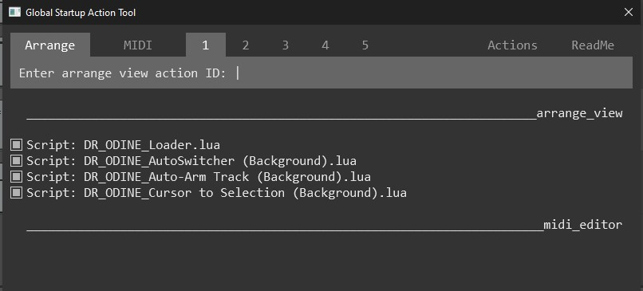
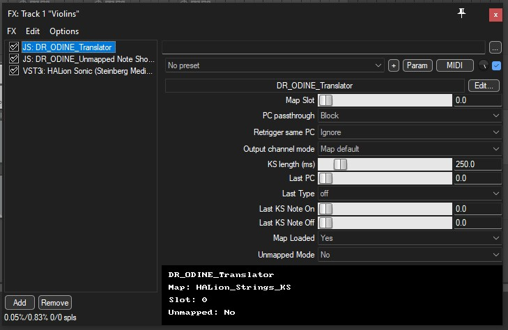
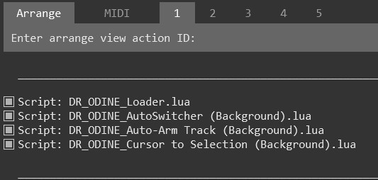

## Dr. Odine's Incredible Notation Enhancement System v1.0   

### Overview

<small>This package is a comprehensive system for REAPER that streamlines the application of articulation, dynamics, ornaments, and any other notation markings to tracks, and then automatically translates them to track MIDI items. ***All without the user ever having to leave the Notation Editor!*** Users will configure their articulation mapping in an .ini file, and then notation markings will always translate to the correct MIDI commands based on what preset and VSTi is selected for that track.

After installing DR_ODINE via Reapack and setting everything up, from that point forward there are only 3 steps in this workflow. Simply (1) choose a reaper preset for the VSTi of your choice (Kontakt, Spitfire, Halion, etc.), and then (2) add your notation markings in the Notation Editor to your notes, and then (3) run the (ApplyNotation.lua) action which applies the notation to all midi items on the current track based on pre-configured maps for your VSTi.

This system is an alternative to the Rearticulate package. The Dr. Odine system converts Reaper notation events/text to MIDI proram change messages, or other CC messages. *The DR_ODINE_Translator.jsfx* or the *DR_ODINE Unmapped Note Shortener.jsfx* then handles the conversion for proper playback.

Dr.Odine's Notation Enhancement System is for composers who prefer working in the **Notation Editor** and would like to avoid the piano roll altogether. No need to mess with MIDI CC automations, velocity settings, or note triggers for sampler modes--instead just let Dr. Odine handle all of that for you in the background :)

The inspiration for this project came from spending time learning and enjoying using Dorico, and then wishing I could have some of that same functionality and workflow of my favorite DAW: Reaper!</small>


 


Store and configure your articulation maps in the provided **DR_ODINE_Maps.ini** file. You can map any type of notation markings, even user-defined notation events, just ensure the text matches exactly how Reaper displays it in the notation events lane.

 

Run the following background scripts on startup using Amely_Suncroll's [Global Startup Action Tool](https://forum.cockos.com/showthread.php?t=294133):



Add the *DR_ODINE_Translator.jsfx* and the *DR_ODINE_Unmapped_Note Shortener.jsfx* plugins to each track fx chain before your VSTi. You can set this to the default chain to avoid having to do this everytime:



Dynamics, accented notes, crescendo and diminuendo is handled without the need to map them in the .ini file. However, these notation markings will be applied to the ModWheel CC1 lane if your preset is mapped, since this is the convention for the most orechestal vsti plugins. If your preset is not mapped, these markings will be converted to note velocity (see more about this below).

This package also includes some scripts that make the process of composing in the notation editor more streamlined:

- Includes an action that toggles between displaying notation for all tracks, and the track that was either last selected, or set as the input track for midi events (step-input).
- Action to **dot** currently seleted notes
- Selecting a note or notes will move the playback cursor to that position
- Intelligent automatic track arming --> if all tracks are selected while in the notation editor, only the track that is selected for step-input will be armed
- Included a modified version of cfillion's step-sequencer replace note script

***But wait, there's more!***

- I have created a new preset browser since this system relies on creating reaper presets. You can assign a key to the new browser which allows you to select other presets for the currently selected track's VSTi without having to open the FX Browser

- Staccato, Marcato, Accent, dynamics and cres./dimi. will be applied to any VSTi note playback even if it hasn't been configured in the map file. Dynamics/Accent/Cres./Dimi. will be converted to velocity data. Staccato and Marcato will be applied to note playback automatically via the Unmapped Note Shortener.jsfx (midi data length will be untouched). Please note that if a VSTi preset *has been mapped* in the .ini file then Staccato and Marcato will be handled by the mapping instead (Program Change value converted to Key Switch), and dynamics will by default be assigned to the modwheel value (since this is the most common convention for orchestral VSTi) rather than the velocity. While in using a mapped preset (mapped mode), you can still apply dynamics to velocity by using the Dynamics to Velocity actions included in this package.

- There is also an included alternate delete action which will automatically move the playback cursor to where the notes began (you'll see in the demo video why this is very useful!)


## Installation Requirements

- REAPER 6.0 or later
- ReaPack package manager for automated installation
- SWS (I have modified a script by cfillion which uses a corresponding .jsfx in the SWS cfillion collection, so this is required for a slightly streamlined note replace function)
- Please also install and utilize the [Global Startup Action Tool](https://forum.cockos.com/showthread.php?t=294133) by Amely_Suncroll to automatically run all the DR_ODINE background scripts at application launch

See the installation instructional video here for a detailed demo of going through all the steps to installing and configuring this package.

## Installation Steps

1. After installing the ReaPack extension, SWS scripts, and Global Startup Action Tool, you are finally ready to install Dr. Odine's Notation Enhancement System via ReaPack. At the top of the screen in your Reaper project, select *Extensions > ReaPack > Import Repositories* and then paste this link there and press Ok:

     ```https://raw.githubusercontent.com/master-NORG/Dr.-Odine-s-Incredible-Reaper-Notation-Enhancement-System/refs/heads/main/index.xml```

      

     

2. The next step is to set the DR_ODINE scripts that must run in the background to automatically load when Reaper starts up. Go to *Actions > Show Action List* and select **Script: Amy Suncroll Global Startup Action Tool.lua**. Then go back to the regular Reaper Actions window and search for the following scripts one at a time, right click them and select **Copy selecte action command ID**, and past them into the Arrange > Enter arrange view action ID: field at the top and hit enter:

- *DR_ODINE_Loader.lua*
- *DR_ODINE_Cursor to Selection.lua*
- *DR_ODINE_AutoSwitcher.lua*
- *DR_ODINE_Auto-Arm Track.lua*

      


3. Now exit and restart Reaper and all the background scripts will load at startup and keep running.

4. For the next step, you will need to spend some time configuring your mapping file (DR_ODINE_Maps.ini) which can be found in the Reaper directory ```Data/DR_ODINE Maps/...``` You can quickly navigate to this folder via the main Reaper menu at top of the screen: *Options > Show REAPER resource path in explorer/finder...*

     You can have up to 32 maps, and then as many presets as you like assigned to any of those maps. So for example, in Halion I have a map for strings since most of string presets use the same note triggers for different articualtion/playing styles (staccato, marcato, tremelo, sustain, legato, etc.):

     

     Create a new map by enclosing square brackets with "map:" and then the title of your map which can be anything you like:

     ```[map:YourMapName]```
     Set the channel for that map (optional)

     Then set the names of the notation events. The titles must match exactly what they are in Reaper. It's okay if you have custom notation markings, just make sure the text matches in the map file:

     ```name.YourArticulationName=ProgramChangeNumber*```

     Then below select which pc number triggers which note:

     ```pc.Number = note=NoteName```

     Once the map is created, you can start assigning presets to that map:

     

     ```[instrument:YourPresetTitle]```

     ```use=MapTitle```

     - **Presets from different instruments** ***CANNOT*** **share titles!** For example, if I have a Violins preset in my Halion VSTi and then a Violins preset from my Spitfire Labs VSTi, then it's better to name the preset titles specifically to that VSTi. So we could choose HAL_Violins and SPF_Violins respectively.

5. After saving your map file, it's now time to finally create your presets for each VSTi you want to have mapped in Reaper. Unfortunately, all VST Instruments do not expose their preset titles to the DAW, so if you have a bunch of presets in an instrument, like Violins, Tubas, Cellos, etc. You will need to open the instrument in reaper, load that preset in the VSTi and THEN create a Reaper preset for it. That is the only way the Dr.Odine system can monitor your instrument and preset selections.


     


- Once you have created Reaper presets for all your instruments presets, then you can either use the preset menu in the FX window native to Reaper to swtich your sounds, or you can use the DR_ODINE_Preset Browse.lua preset browser, which is what I recommend. With the Dr. Odine Preset Browser, you only have to select the track (which is automatic if you are already inside a midi item) and then run the action which can be assigned to any key, and all of your presets for that VSTi will show up in a new window and you can double click them, or search for them and hit enter to load it.

     


6. Now you are done setting up mostly everything. The very last step is just to assign keyboard shortcuts to all the scripts that I have included to be used as an action. These include the following actions:

- *ApplyNotation.lua* - This is what you will be using most. Assign this to a keyboard shortcut to apply the notation markings you have added to the selected track (or track set for step-input if multiple tracks are selected)

- *ToggleAll_Target Track.lua* - When you have the Notatoin Editor (or MIDI Editor) open, use this command to toggle between viewing all tracks and a single track.

- *Preset Browser.lua* - As explained earlier, this will open a menu to select presets for the current VSTi, which is much faster than having to open the FX Browser window and selecting your VSTi and then finally selecting the preset there.

- *Dynamics to Velocity (All).lua* & *Dynamics to Velocity (Selected Notes).lua* - these scripts are for when you are in mapped mode (aka you are using a preset that has been mapped) and you would like to apply dynamics markings to the velocity. Most orchestral plugins use the ModWheel for dynamics rather than velocity, but sometimes playing styles like staccato will listen the note velocity value rather than the modwheel value. So this allows you to apply dynamics to velocity for all the notes it the track, or just the notes you have selected.

### MIDI Editor Specific Actions:

- *Delete and Move Playback.lua* - if you are using step-input mode and want to delete the notes you just inputted, the standard delete action in Reaper will delete the notes,but not move the cursor back to the beginning of where you started inputting notes. This action will move the playback cursor for you, so I recommend swapping this out for the standard delete action in the midi editor actions (not the arrangement actions though)

- *dotted_notes.lua* - this just turns any selected note into a dotted note by adding 50% to its length

### DR_ODINE_Step sequencing (replace mode).lua - this is simply a slightly tweaked version of cfillion's replace mode script:

***Core Replace Mode Logic***

- **Smart Note Replacement**: Instead of layering new notes on top of existing ones, the script identifies notes that start within the current grid unit and replaces them entirely. This prevents accumulation of overlapping notes during iterative composition.

- **Grid-Based Timing**: All input is quantized to the current MIDI grid setting. Each step input creates notes that span exactly one grid unit in length, then automatically advances the cursor to the next grid position.

- **Modified Replacement Logic**: The key change from the original is in findNotesInRange() - it only targets notes that start within the current grid unit, not notes that merely overlap it. This prevents deleting sustained notes from previous beats while still clearing the current beat for new input.


And that's all folks! See the reference section below for a breakdown of what each script does. 


# Reference Section

## Core Components

### JSFX Effects

#### Translator.jsfx
**Purpose**: Main articulation processor that converts Program Change messages to keyswitch notes, CCs, or other MIDI events.

**Features**:
- **Dual Mode Operation**: Mapped mode and unmapped mode (intelligent fallback).
- **Shared Memory Integration**: Uses gmem to store mapping configurations across multiple instances
- **Real-time Map Display**: Shows current map name and slot information in the UI
- **Automatic Mode Switching**: Seamlessly switches between mapped/unmapped based on AutoSwitcher input
- **Pre-roll Support**: Shifts Program Changes earlier in time to ensure keyswitches trigger before notes
- **Cross-item Processing**: Can extend pre-roll into adjacent previous items for seamless playback
- **Channel Routing**: Maps incoming PC messages to different output channels as needed

**Configuration Parameters**:
- Map slot selection (0-31)
- Program Change (PC) message passthrough toggle
- Retrigger control for same PC values
- Output channel mode selection
- Keyswitch length timing (default 250ms)

#### Unmapped Note Shortener.jsfx
**Purpose**: Shortens note lengths based on CC119 articulation markers for any VSTi without any user created mapping. Use the sliders for staccato and marcato to set your own custom note playback length for the notes, regardless of the length of the actual midi in the track.

**Features**:
- **CC119 Stamp Processing**: Reads articulation tags (staccato/marcato) from CC119 messages
- **Intelligent Note Shortening**: Applies different lengths based on articulation type
- **Aliasing Prevention**: Handles note-on/note-off timing to prevent stuck notes
- **Cross-block Stability**: Manages scheduled note-offs across audio processing blocks
- **Safe Toggling**: Can be disabled without stranding active notes

### Core Processing Scripts

#### ApplyNotation.lua
**Purpose**: Main articulation and dynamics processor that converts text events to Program Changes and CC1 dynamics.

**Features**:
- **Dual Processing Modes**: Mapped mode with INI configuration, unmapped fallback for unconfigured instruments
- **Text Event Parsing**: Converts notation software articulation text to MIDI events
- **Dynamic Dynamics Processing**: Handles crescendo, diminuendo, and accent markings with proper cross-item ramping
- **Intelligent Pre-roll**: Shifts Program Changes earlier to ensure keyswitch timing
- **Cross-track Processing**: Searches across multiple items for crescendo targets
- **Accent Enhancement**: Automatically boosts dynamics for accent markings
- **Toast UI Feedback**: Provides visual feedback without cluttering REAPER console

**Supported Text Events**:
- Articulations: sustain, staccato, legato, marcato, pizzicato, spiccato, tremolo
- Dynamics: ppp, pp, p, mp, mf, f, ff, fff
- Special markings: crescendo, diminuendo, accent
- Phrase markings: automatic legato detection from slur indicators

#### Dynamics to Velocity Scripts (All Notes / Selected Notes)
**Purpose**: Alternative processing that applies dynamics directly to MIDI note velocities instead of CC1 while in mapped mode.

**Features**:
- **Direct Velocity Mapping**: Converts dynamic markings to note velocities
- **Crescendo Ramping**: Calculates smooth velocity transitions across note ranges
- **Accent Processing**: Boosts velocity for accented notes
- **Selective Processing**: "Selected Notes" variant only affects currently selected MIDI notes
- **Cross-item Intelligence**: Handles crescendos that span multiple MIDI items

### System Automation Scripts

#### Loader.lua
**Purpose**: Initializes the DR_ODINE system by loading configuration data into shared memory.

**Features**:
- **INI File Processing**: Parses DR_ODINE_Maps.ini configuration file
- **Shared Memory Population**: Loads maps into gmem slots for JSFX access
- **Registry Generation**: Creates lookup tables for instrument-to-slot mapping
- **Fuzzy Matching Setup**: Builds normalized lookup indices for flexible instrument name matching
- **Roman/Arabic Numeral Handling**: Converts between different numbering systems in instrument names

**Process Flow**:
1. Parse DR_ODINE_Maps.ini file structure
2. Assign map slots (0-31) to defined maps
3. Write map data to gmem blocks
4. Generate DR_ODINE_Maps_Slots.ini registry file
5. Create normalized lookup tables for AutoSwitcher

#### AutoSwitcher.lua
**Purpose**: Automatically switches between mapped and unmapped modes based on instrument presets.

**Features**:
- **Real-time Monitoring**: Continuously watches for instrument preset changes
- **Intelligent Matching**: Uses fuzzy matching with roman numeral conversion for instrument names
- **Automatic JSFX Configuration**: Sets Translator JSFX parameters based on matching results
- **Note Shortener Integration**: Enables/disables Note Shortener JSFX as appropriate
- **Multi-track Processing**: Handles all tracks with DR_ODINE_Translator JSFX simultaneously

**Matching Logic**:
1. Exact preset name match
2. Normalized text comparison (case/space insensitive)
3. Roman numeral to digit conversion
4. Substring matching with length prioritization

### Background Workflow Scripts

#### Auto-Arm Track (Background).lua
**Purpose**: Manages record arming based on track selection and MIDI editor state.

**Features**:
- **Smart Track Arming**: Single selected track gets armed, others get disarmed
- **MIDI Editor Integration**: When multiple tracks selected, arms only the MIDI editor target track
- **Automatic Disarming**: Prevents accidental recording on wrong tracks
- **Background Operation**: Runs continuously with minimal CPU impact
- **State Change Detection**: Only processes when selection actually changes

#### Cursor to Selection (Background).lua
**Purpose**: Synchronizes edit cursor with selected MIDI notes for improved workflow.

**Features**:
- **Automatic Cursor Movement**: Moves cursor to earliest selected note position
- **Step Input Detection**: Pauses operation during step input to avoid interference
- **Multi-track Support**: Works across multiple selected tracks intelligently
- **Selection Change Detection**: Only moves cursor when selection actually changes
- **Playback Awareness**: Disables during playback to avoid disruption

### MIDI Editing Utilities

#### Delete and Move Playback.lua
**Purpose**: Deletes selected MIDI notes and moves cursor to where the first note was located.

**Features**:
- **Smart Deletion**: Works backwards through note list to avoid index shifting issues
- **Cursor Positioning**: Moves edit cursor to the earliest deleted note's position
- **Proper Cleanup**: Sorts MIDI events and updates project state after deletion
- **Undo Integration**: Single undo block for the complete operation

#### dotted_notes.lua
**Purpose**: Extends selected MIDI notes by 50% to create dotted note lengths.

**Features**:
- **Precise Length Calculation**: Increases note length by exactly 50%
- **Cursor Advancement**: Moves cursor forward by the extension amount
- **Batch Processing**: Handles multiple selected notes simultaneously
- **Mathematical Rounding**: Ensures PPQ values remain valid integers

#### Step Sequencing (Replace Mode)
**Purpose**: Enhanced step input with note replacement functionality.

**Features**:
- **Replace Mode Logic**: Replaces existing notes instead of layering
- **Helper JSFX Integration**: Automatically manages input processing JSFX
- **Grid-based Timing**: Aligns input to current grid settings
- **Configurable Replacement**: Options for channel/pitch/velocity replacement
- **Active Note Row Updates**: Updates MIDI editor note row based on last played note

### Utility Scripts

#### Preset Browser.lua
**Purpose**: Searchable, scrollable browser for VSTi presets.

**Features**:
- **Dynamic Discovery**: Auto-detects preset files for any VSTi
- **Search Functionality**: Real-time filtering of preset list
- **Scrollable Interface**: Handles large preset collections efficiently
- **Double-click Loading**: Quick preset selection and loading
- **Cross-platform Compatibility**: Works with different VSTi preset storage formats

#### Toggle All_Target Track.lua
**Purpose**: Smart track selection toggle for focused editing workflows.

**Features**:
- **Intelligent Toggling**: Switches between all tracks selected and MIDI editor target only
- **Context Awareness**: Determines target track from MIDI editor state
- **Workflow Optimization**: Reduces clicks needed for common selection patterns

## System Configuration

### DR_ODINE_Maps.ini Structure

The configuration file uses a hierarchical structure:

**Map Definitions** (`[map:MapName]`):
- Define base articulation mappings for instrument families
- Specify default channels (optional), keyswitch lengths (optional), and bank select information
- Map articulation names to Program Change numbers
- Map Program Change numbers to output events (notes, CCs, or PC passthrough)

**Instrument Definitions** (`[instrument:InstrumentName]`):
- Inherit from base maps using `use=MapName` syntax
- Override specific articulations with `pc.N = off` to disable unsupported articulations
- Allow per-instrument customization while maintaining consistent base templates

### Workflow Integration

The complete DR_ODINE workflow operates as follows:

1. **Initialization**: Run Loader.lua to populate shared memory with configuration data
2. **Background Services**: Start AutoSwitcher and Auto-Arm Track scripts for automation
3. **Track Setup**: Add Key Switch JSFX and optionally Note Shortener JSFX to instrument tracks
4. **Composition**: Write music using text events for articulations and dynamics
5. **Processing**: Run ApplyNotation.lua to convert notation events (articulation, dynamics, playing styles, etc.) to MIDI commands
6. **Playback**: System automatically handles keyswitch timing and articulation switching

## Advanced Features

### Cross-item Processing
The system intelligently handles musical elements that span multiple MIDI items:
- Crescendos can target dynamics in subsequent items
- Pre-roll Program Changes can extend into previous adjacent items
- Dynamic state tracking maintains consistency across item boundaries

### Fuzzy Instrument Matching
AutoSwitcher uses sophisticated matching logic:
- Case and punctuation insensitive comparison
- Roman numeral to arabic numeral conversion (and vice versa)
- Substring matching with length-based prioritization
- Handles common orchestral naming variations
